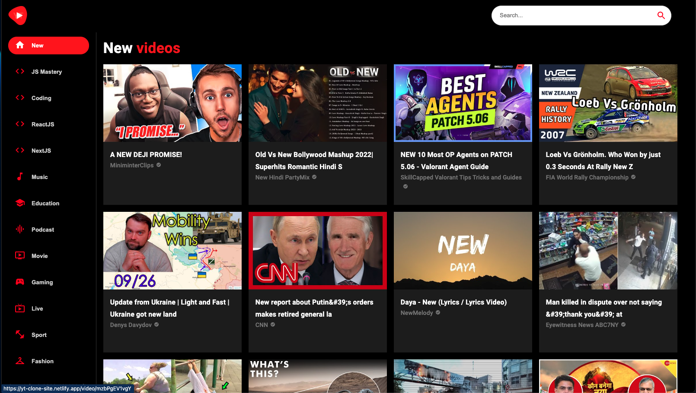
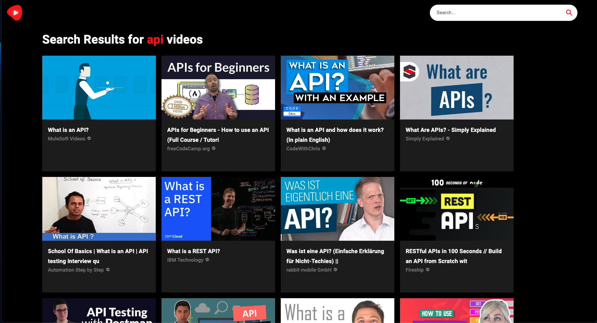
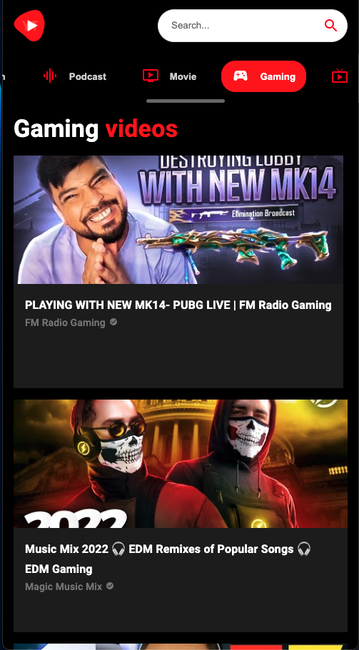

# YouTube Clone React App

This application is a modified clone of YouTube. You are able to browse and search videos from different categories.

To access the application, please visit: https://yt-clone-site.netlify.app/

## Packages and API Used:

1. Material UI
2. React Router
3. Axios
4. React Player
5. Rapid API (YouTube v3)

## Demo Screenshots

### **_Home Page_**

---

### **_Search Page_**

---

### **_Mobile View_**

---

